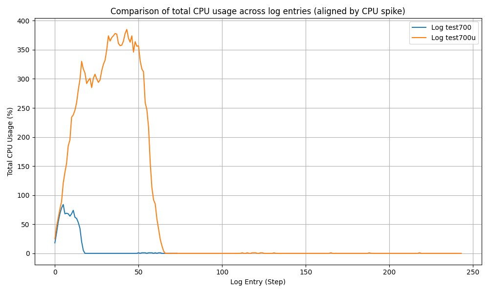
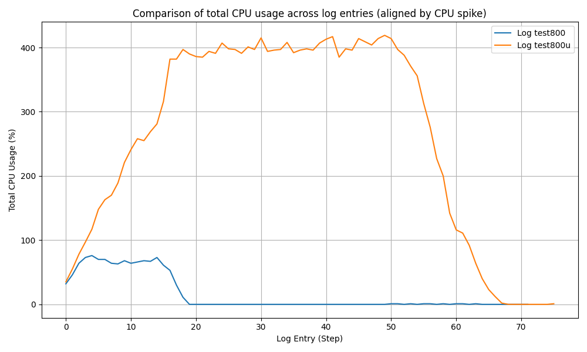
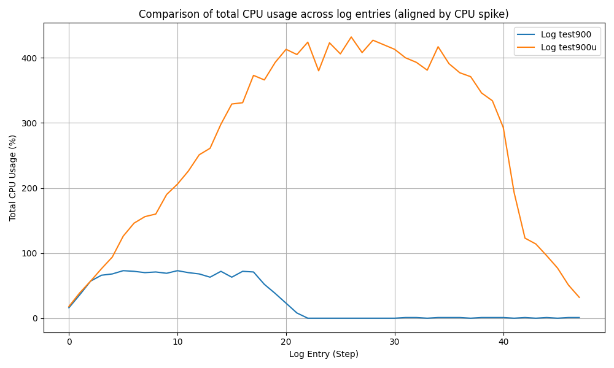
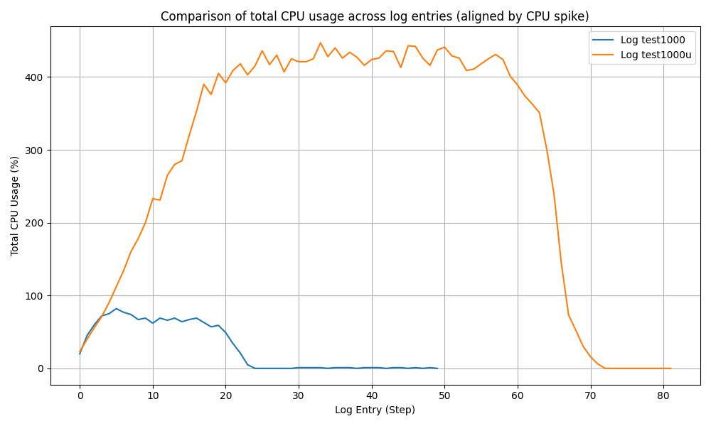
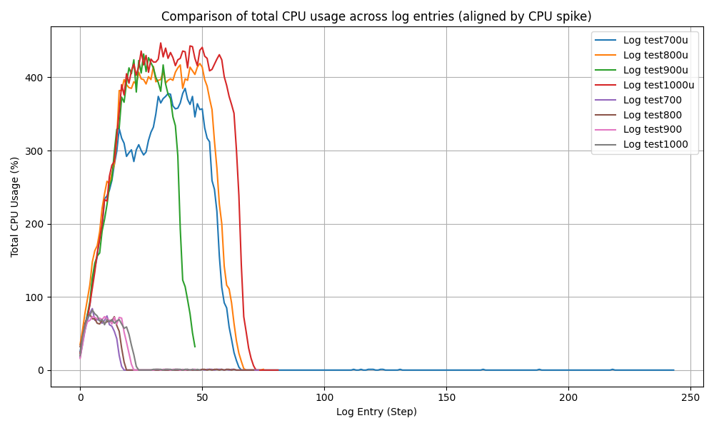
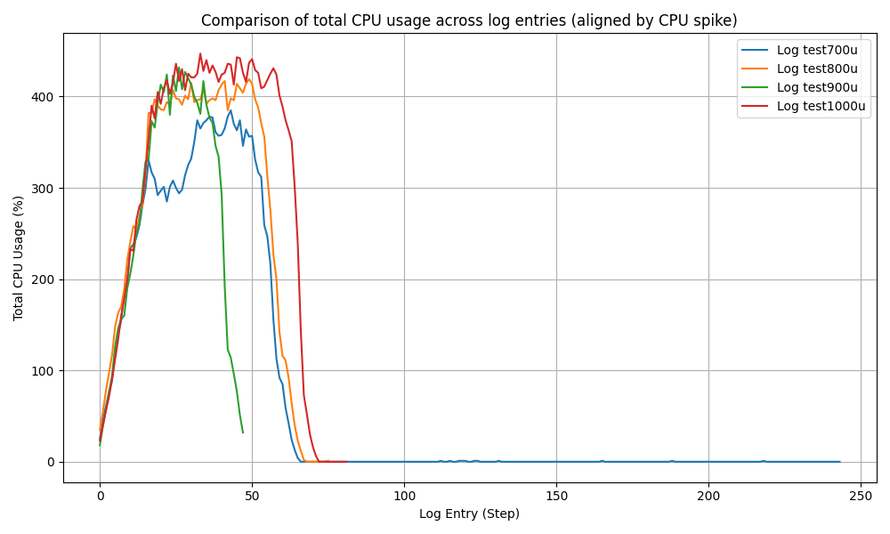
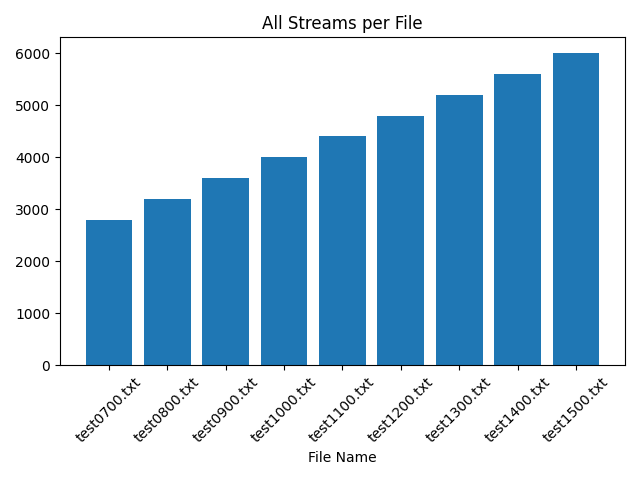
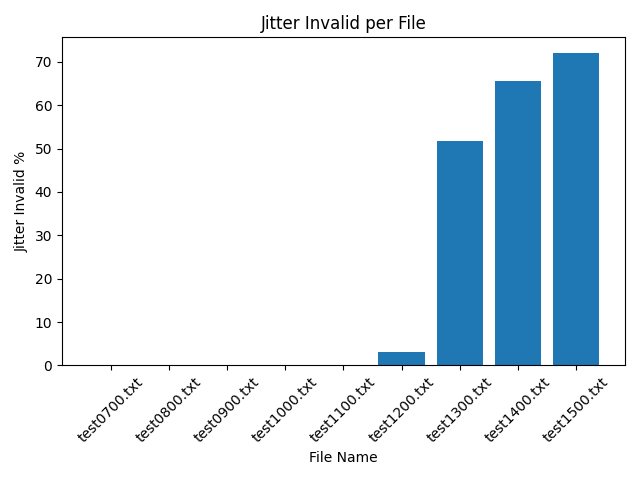

# Build & Run RTPENGINE in kernel mode

Other possibly working method to install on Ubuntu: [Link](https://nickvsnetworking.com/rtpengine-installation-configuration-ubuntu-20-04-22-04/)
## Build
1. Clone this [repo](https://github.com/sipwise/rtpengine)
- Following the instructions in the official [document](https:/rtpengine.readthedocs.io/en/latest/compiling_and_installing.html) for installation:
2. Install the requirements (You may need to install some packages manually)
- `sudo apt-get update && apt-get install pkg-config libglib2.0-dev zlib1g-dev libssl-dev libpcre3-dev libxmlrpc-core-c3-dev libhiredis-dev gperf libcurl4-openssl-dev libevent-dev libpcap-dev libsystemd-dev libspandsp-dev libiptc-dev ffmpeg libavcodec-dev libavfilter-dev libswresample-dev`
- `apt-get update && apt-get install libmosquitto-dev libwebsockets-dev libopus-dev libmysqlclient-dev pandoc libnftnl-dev libjson-glib-dev libmnl-dev`
	- `sudo apt-get update && apt-get install linux-headers-$(uname -r) linux-image-$(uname -r)-dbg`
	- `E: Unable to locate package libbcg729-0-dev` :: manual install  
1. At the top directory of `./rtpengine` run `make` (If the requirements are all satisfied, It will build successfully)
2. If you need to use kernel mode:
- run `make` and `make install` in `./rtpengine/kernel-module`
- `insmod xt_RTPENGINE.ko`
- `sudo cp xt_RTPENGINE.ko /lib/modules/$(uname -r)/`
- `/lib/modules/$VERSION/updates/`
- `depmod -a`
- `sudo modprobe xt_RTPENGINE`
## Run
- Following the instructions in the official [document]( https://rtpengine.readthedocs.io/en/latest/usage.html ) for setup and usage:
1. Configure `rtpengine` in `./rtpengine/etc/rtpengine.conf`:
- `table = 0` (or any other number for `iptable`/`nftable` on kernel mode)
- `table = -1` for not allowing kernel module
- `interface` and `listen-*` parameters should be set according to the machines you are running on
- change and increase the range `port-min` and `port-max` for handling high level of streams 
2. At the top directory of `/rtpengine` run `./daemon/rtpengine --foreground --config-file ./etc/rtpengine.conf --pidfile=rtpengine.pid` to run the daemon
3. To see the status of `rtpengine`. (If the kernel mode is active or not):
- `ls /procat /proc/rtpengine/0/status` to see the status
- ls `/proc/rtpengine/` (If the table number `0` (or any other) does not exists, kernel mode is deactivated)
- `cat /proc/rtpengine/0/list` to see the running rules on streams. Run this when testing calls to see the forwarding RTP streams
- To see rule set on `nftable`: `sudo nft list ruleset` (look for `rtpengine).` (The `XT target RTPENGINE not found` is normal !)
- To see the rule set on `iptables` : `iptables -L -v -n`
- To see if the kernel module is loaded: `lsmod | grep xt_RTPENGINE`
4. Attention: running on this mode and not with pre-build packages and `systemctl`, on stopping the process, `rtpengine` exits. the important logs are displayed where the daemon command is running
- To check the CPU status of `rtpeninge`: `pidstat -p $(pidstat | grep rtpengine | awk '{print $4}') 1` or `pidstat -C rtpengine`


  

# Testing RTPENGINE, Checking performance & quality with SIPP
## Test steps:
1. initialize `rtpengine` on the correct configue:
- `./daemon/rtpengine --foreground --config-file ./etc/rtpengine.conf --no-fallback --pidfile=rtpengine.pid`
2. check if correct config:
- `cat /proc/rtpengine/0/list` in same machine as rtpengine
- `No such file or directory` in user-space mode and null or rtp list on kernel mode
3. capture cpu usage
- `pidstat -p $(pidstat | grep rtpengine | awk '{print $4}') 1` optional: `> storefile.log`
4. capture rtp streams
- `tcpdump -i any -w test.pcacp`
5. compose kamailio
- initialize pcscf on the same host machine as rtpengine
6. on sipp server machine:
- `./sipp -sf server.xml -inf p2.csv 192.168.21.83:5060 -mi 192.168.21.57 -p 6070 -mp 20000 -m 2000`
7. on sipp client machine:
- `./sipp -sf client.xml -inf p1.csv 192.168.21.45:5060 -p 6060 -mi 192.168.21.56 -mp 10000 -d 20s -r 50 -rp 1s -m 2000`
8. wait till sipp is finished and then stop the capture

  

  

## Performance Test

  

انجام تست‌های مختلف در حالت kernel mode و userspace mode و مقایسه نمودار cpu usage آنها










## Quality Test
`rtp-analyse.py`
- by using `tshark`, analyses the RTP streams in the captured pcap, and analyse it for quality.
- Sample output: (for n=1000)
```
Creating csv file
Analyzing Quality
------------------------------
All streams: 4004
Valid streams : 4000
Failed calls: 4 (<50.0% success)
------------------------------
Unpaired SSRCs: 4
Broken streams: 5
------------------------------
Jitter invalid: 0 (>30.0)
Lost invalid: 0 (>0.5%)
------------------------------
Test Pass
------------------------------
```


# Testing Script 
Functionality:
run the test with two sipp machines to capture the cpu usage for performance assess and network capture for call quality assessment.

Steps:
- `kamailio` & `rtpengine` should be up on the same machine as the testing script
- `sshpass` and `tshark` should be installed via apt
- python in required and `pandas` need to be installed via pip
1. install prerequisites: `pip instal panads`
2. `cp config.example config`
3. modify config file to match your machine
4. `chmod +x testing.sh`
5. `./testing.sh`
6. input the call count
# Issues

# on quality test

- Packet loss in RTP streams are too high
	-> changing network interface card to test
	on range 100 (isolated NIC)
	changing all commands from `192.168.21.*` to `192.168.100.*` (excluding ssh commands)
	- kamailio.cfg
	- rtprngine.conf
	- client-performance.sh  & server-performance.sh 
	- test_rtpengine.py

- We need to tune the OS for high packet handling
- Handling tests with python or bash script causes more packet loss and limit on packet receive!! (4097 valid streams). مشکل جدی: فیل شدن تست ها بعد ۱۰۰۰ در تستینگ اسکریچت
تفاوت کیفیت با تست دستی حتی در بش اسکریپت!!!

- Reason: each time ssh to the sipp machine `ulimit -n` should be set again. so in the script that we `sshpass`, we should run `ulimit` too.
	- `ulimit -n` is temporary configuration. with each terminal session it should be set again
	- نتایج همچنان تفاوت ریزی در تست با اسکریپت و دستی دارند
## Customization on machines:
- `ulimit -n ${n}` on all machines participating in the test: most importantly the SIPP machines. (should be 1000*$n. n being the number of your concurrent call)
- `network_tuning.sh` for IRQ balancing and buffer size change (remove irqbalance module)
# Report


[ValidStreams](report/Q-ValidStreams.png)
[FailedCalls](report/Q-FailedCalls.png)
[UnpairedSSRCs](report/Q-UnpairedSSRCs.png)
[BrokenStreams](report/Q-BrokenStreams.png)
[LostInvalid](report/Q-LostInvalid.png)



# Virtualization 